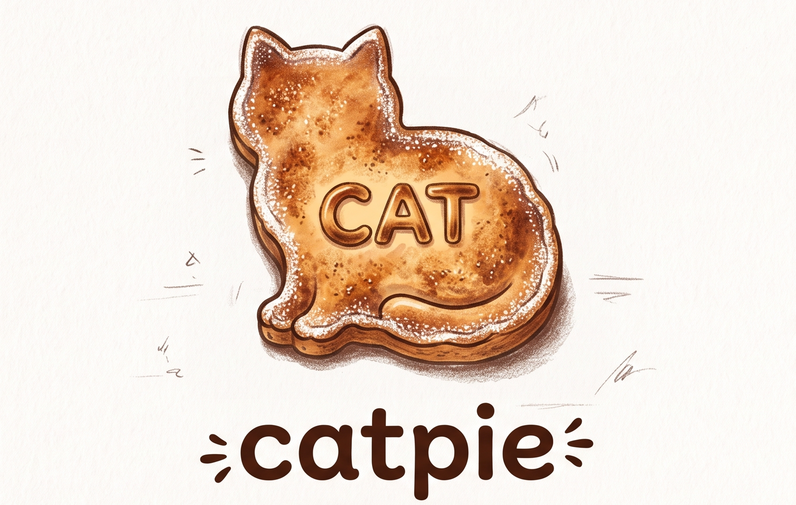

# catpie


[](https://github.com/dfsp-spirit/catpie/actions/workflows/ci.yml)
[](https://github.com/dfsp-spirit/catpie/actions/workflows/validate.yml)
[](https://github.com/dfsp-spirit/catpie/actions/workflows/docs.yml)

A faithful **Python translation of the most relevant feature subset of the R package
[catR](https://cran.r-project.org/package=catR)**, with **zero runtime dependencies** (pure
Python standard library only).





Provides Computerized Adaptive Testing (CAT) based on Item Response Theory (IRT) for
psychological experiments. It is the Python sibling of the JavaScript port
[**catjs-irt**](https://github.com/dfsp-spirit/catjs-irt): both are faithful translations of
the same catR subset, validated against the *real* R package, and the two ports use
line-by-line matching code so that results agree with catR — and with each other — to
floating-point precision.


## About

Basically, this lets you run "smart" questionnaires that adapt to each person as they answer:

* **Pick the next question on the fly** — given a bank of questions with known difficulties and
  the participant's answers so far, it chooses the next question that will teach you the most
  about their true ability level (rather than asking everything in a fixed order).
* **Estimate skill live** — from the questions asked and how the person answered, it
  continuously estimates their ability (and how confident that estimate is) after every response.
* **Simulate & test your test** — it can generate fake response patterns and run entire adaptive
  sessions offline, so you can validate question banks and stopping rules before deploying the
  real experiment (e.g., in jsPsych or PsychoPy).

Read [this paper by the catR authors](https://www.jstatsoft.org/article/view/v048i08) for all the
details.

Unlike alternatives such as `py2r` (which shell out to R), catpie is a **pure Python**
re-implementation with no R runtime and no heavy dependency chain — so it plays nicely inside
large Python environments such as PsychoPy-based experiment stacks.


## Documentation


**API Docs** <https://dfsp-spirit.github.io/catpie/> (user-friendly docs for
beginners: concepts, quickstart, and a full API reference).


## Installation


### Directly from PyPI (Recommended)


The package is available on PyPI: [pypi.org/project/catpie/](https://pypi.org/project/catpie/)

So all you have to do is:

```shell
pip install catpie
```


### From a git checkout of this repo

The package is managed with [uv](https://docs.astral.sh/uv/). From a checkout:

```shell
uv sync --group dev     # creates .venv with the package + pytest (dev group)
uv run python -c "import catpie; print(catpie.__version__)"
```

To use it in another project:

```shell
uv add catpie           # once published to PyPI
# or, from a local checkout:
uv add --editable /path/to/catpie
```

## What is ported

| catR function                     | catpie (`src/catpie/…`)                     | Notes |
|-----------------------------------|---------------------------------------------|-------|
| `Pi()` / `Ii()` / `Ji()`          | `pi()` / `ii()` / `ji()`  (`irf.py`)        | 4PL IRF + Fisher info + derivatives |
| `thetaEst(method="EAP")`          | `thetaEst()` / `estimateTheta()` (`eap.py`, `estimators.py`) | ability estimate |
| `thetaEst(method="BM"/"ML"/"WL")` | `thetaEst()` (`estimators.py`)              | root-finding, catR's exact algorithm |
| `semTheta(method="EAP"/"BM"/"ML"/"WL")` | `semTheta()` (`estimators.py`)       | standard error |
| `nextItem(criterion="MFI"/"bOpt")`| `nextItem()` / `selectNextItem()` (`selection.py`) | adaptive item selection |
| `genPattern`                      | `genPattern()` (`simulation.py`)            | 0/1 response generation |
| `checkStopRule`                   | `checkStopRule()` (`simulation.py`)         | length/precision/classification/minInfo |
| `randomCAT` (minimal)             | `randomCAT()` (`simulation.py`)             | catR-inspired loop |

Faithfully replicated details:

* 4PL IRF with catR's exact clamp (`P==0 → 1e-10`, `P==1 → 1-1e-10`) and the full derivative set
  (`dP`, `d2P`, `d3P`, `Ii`, `dIi`, `d2Ii`, `Ji`, `dJi`), including catR's overflow behaviour
  (when the logistic exponent overflows, `P` becomes `NaN`, exactly as in R).
* EAP over catR's **33-point grid** `seq(-4, 4, length=33)`, priors `norm` / `unif` / `Jeffreys`,
  and catR's **trapezoid** integration.
* BM/ML/WL exactly as catR: solve the score equation by bisection (`uniroot`) over
  `range=(-4, 4)`, with catR's `optimize()`-based fallback when the score does not change sign.
* MFI / bOpt selection with catR's random tie-breaking (`randomesque=1`).

## Usage

```python
from catpie import estimateTheta, genPattern, randomCAT, selectNextItem

# Item bank: (a, b, c, d) = (discrimination, difficulty, guessing, inattention)
bank = [
    (1.0, -1.0, 0.20, 0.95),
    (1.5,  1.0, 0.10, 0.98),
    # ...
]

administered = []
responses = []

# Select first item (theta starts at 0)
sel = selectNextItem(bank, 0.0, administered)
administered.append(sel.item)

# ... run the trial, score it (1/0) ...

# Estimate ability + SE (EAP by default; BM/ML/WL via method="...")
res = estimateTheta(bank, administered, responses)
print(res.theta, res.se)

# Full simulation (selection + response + estimation + stopping)
run = randomCAT(0.7, bank, method="EAP",
                stop={"rule": ["precision", "length"], "thr": [0.3, 10]})
print(run.finalTheta, run.finalSe)
```

Item indices are **0-indexed** in the public API.

## Parity with catR (the proof of concept)

The repo ships a validation harness that compares the Python port against the **real R `catR`
package**. Ground-truth catR output is committed under `reference/` and replayed on every change
via continuous integration, so parity cannot silently degrade.

You can run the checks locally (R + catR only needed to *regenerate* the references, not to run
the checks):

```shell
# 1. (optional) Regenerate ground-truth catR output (needs R + catR + jsonlite)
Rscript scripts/generate_reference.R /path/to/your/itembank.csv
Rscript scripts/generate_reference_goodbank.R
Rscript scripts/generate_reference_derivatives.R /path/to/your/itembank.csv

# 2. Replay every step in Python and compare
uv run python scripts/validate.py
uv run python scripts/validate.py reference/catr_reference_goodbank.json
```

`generate_reference.R` simulates adaptive runs (selection + estimation for EAP/BM/ML/WL and
priors) on the item bank and stores catR's exact output in `reference/catr_reference.json`;
`validate.py` replays every step with catpie and reports maximum absolute differences.

> catR samples randomly among items tied at the optimum. The validation therefore checks the
> criterion values (`Ii`, `|b−θ|`) exactly and item *selection* for tie-consistency.

### Measured results

**Real EWM item bank (145 items, catR 3.17 / R 4.6.1)** — the experiment's exact path
(EAP + MFI + bOpt):

| Quantity | Comparisons | Max \|diff\| |
|----------|-------------|--------------|
| ability estimate `theta` (EAP) | 500 | 8.9e-16 |
| standard error `se` (EAP)      | 500 | 2.2e-16 |
| item information `Ii`          | 72,500 | 0.0 (exact) |
| MFI selection                  | 500 | 0 mismatches |
| bOpt selection                 | 500 | 0 mismatches |
| IRF derivatives (`Pi`/`Ii`/`Ji`) | 9,132 | 5.8e-11 |

**Well-behaved bank (40 realistic items)** — proves the BM/ML/WL port:

| Quantity | Comparisons | Max \|diff\| |
|----------|-------------|--------------|
| EAP `theta` / `se`             | 240 | 8.9e-16 |
| BM / ML / WL `theta`           | 720 | 8.2e-5 (catR's own uniroot tol is ~1.2e-4) |
| BM / ML / WL `se`              | 720 | 7.6e-5 |
| MFI / bOpt selection           | 480 | 0 mismatches |

So the experiment's EAP path matches catR to **floating-point precision** (on the same machine,
Python and R share the same C library math functions, so agreement is even tighter than the
sibling JS port), and BM/ML/WL match catR to **catR's own numerical precision**.

## Development

```shell
uv sync --group dev        # install package + dev deps (pytest)
uv run pytest              # unit tests (no R needed)
uv run python scripts/validate.py            # parity vs committed catR references
uv run python scripts/validate.py reference/catr_reference_goodbank.json  # strict BM/ML/WL
uv run python examples/demo.py               # demo
```

### Building the documentation

The user-friendly documentation (built with MkDocs + mkdocstrings) lives in
[`docs/`](docs/) and is published to GitHub Pages by the
[`Docs` workflow](.github/workflows/docs.yml). Build it locally with:

```shell
uv sync --group docs
uv run mkdocs build --strict   # outputs to site/
uv run mkdocs serve            # live preview at http://localhost:8000
```

## Scope / non-goals

* The dichotomous model with methods `EAP`/`BM`/`ML`/`WL`, priors `norm`/`unif`/`Jeffreys`, and
  criteria `MFI`/`bOpt` are implemented. The rest of catR (polytomous models, other criteria,
  content balancing, exact SEM, robust estimation) raises a clear "not implemented" error.
* `randomesque` is fixed at catR's default `1`.
* The numerics mirror catR exactly, including its known weaknesses (raw product likelihood,
  33-point grid). Making it *more* robust than catR is a deliberate follow-up, after parity is
  proven.
* **Important:** on the real (degenerate) test item bank, BM/ML/WL are numerically unstable in
  catR *itself* (catR clamps ~1/3 of ML estimates to ±4). Only EAP is robust there — which is
  what the EWM experiment uses.

## Acknowledgements, Getting Help, Author and License

catpie was written by [Tim Schäfer](https://ts.rcmd.org/), who translated the
[catR](https://cran.r-project.org/web/packages/catR/index.html)
[source code](https://github.com/cran/catR) to Python (and previously to JavaScript as
[catjs-irt](https://github.com/dfsp-spirit/catjs-irt)). **catpie is a Python translation of the
R package `catR` — it is not written or endorsed by the catR authors.** All credit for the
methods implemented here goes to them:

- **David Magis** (University of Liège, Belgium)
- **Gilles Raîche** (Université du Québec à Montréal, Canada)
- **Juan Ramón Barrada** (University of Zaragoza, Spain)

The catR package is currently maintained by **Cheng Hua**.

### Citing catR

If you use catpie in academic work, please cite the catR papers (and your own paper for the
adaptive task, if applicable). The authoritative citation information is provided in the
[catR citation file](https://cran.r-project.org/web/packages/catR/citation.html) on CRAN. The
two main references are:

- Magis, D., & Raîche, G. (2012). Random generation of response patterns under computerized
  adaptive testing with the R package **catR**. *Journal of Statistical Software*, 48(8), 1–31.
  <https://doi.org/10.18637/jss.v048.i08>
- Magis, D., & Barrada, J. R. (2017). Computerized adaptive testing with R: Recent updates of the
  package **catR**. *Journal of Statistical Software*, 76(1), 1–19.
  <https://doi.org/10.18637/jss.v076.c01>

### License

catpie is licensed under the **GNU General Public License v3.0 or later** (GPL-3.0-or-later),
matching the catR package (GPL ≥ 3), since this is a derivative translation of its source code.
See [`LICENSE`](LICENSE).
